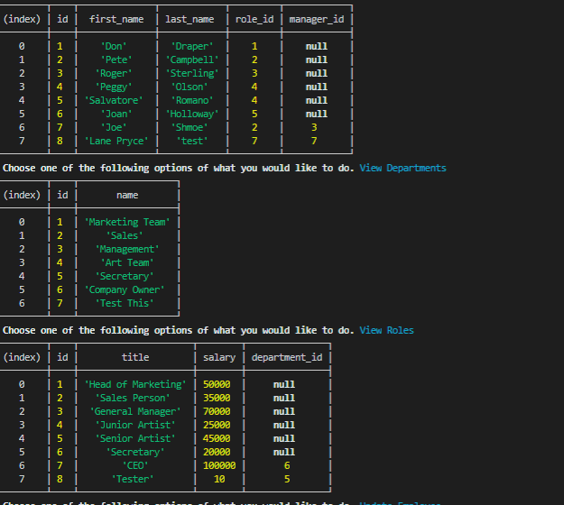

# Employee Tracker

## Description
 For this application we created an Employee Tracker to work with a database to let someone add and update different things about a company focused on employee status.
## To test:

The user should :

  * NPM I to install npm packages

  * then run the command 'node index.js'.

  

## Github repo and deployment link:

<a href="https://github.com/H-garr/Employee-tracker">Repo</a>

## Questions and Concerns:
Contact me at :
<a href="https://hagarrard@gmail.com">hagarrard@gmail.com</a>

## Walkthrough Video & Picture: 

<a href="https://drive.google.com/file/d/1CPG3-1X17XvdjIOkgnk-kJdErW5a6jAR/view">Video Here</a>
- - -
© 2021 Trilogy Education Services, LLC, a 2U, Inc. brand. Confidential and Proprietary. All Rights Reserved.